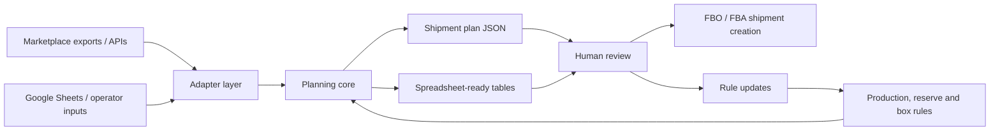

<p align="center">
  
</p>

<h1 align="center">Marketplace FBO Planner</h1>

<p align="center">
  <strong>From messy marketplace exports to an auditable warehouse replenishment plan.</strong>
</p>

<p align="center">
  <a href="https://github.com/Volchok09/marketplace-fbo-planner/actions/workflows/ci.yml"></a>
  <a href="LICENSE"></a>
  
  
  
</p>

Marketplace FBO Planner is an open-source replenishment planning toolkit for marketplace sellers. It helps decide what to send to each warehouse, how many units to send, and how to pack the shipment while respecting demand, FBO stock, inbound stock, route coverage, production availability, reserve stock, and box constraints.

The project is extracted from a real weekly FBO workflow used by a small automotive accessories manufacturer. The public repository contains the reusable core and anonymized samples only. Private seller credentials, spreadsheet IDs, real SKUs, prices, and operational data are intentionally out of scope.

## Why It Matters

Marketplace sellers rarely lose money because they cannot export a report. They lose money because the decision sits between too many disconnected surfaces:

- seller dashboards recommend one thing;
- spreadsheets know stock and production;
- warehouse availability changes every week;
- box and pallet thresholds quietly change unit economics;
- non-local logistics fees punish the wrong warehouse choice;
- human operators still need to review the final plan before creating shipments.

This project turns that operational mess into a repeatable planning loop.

## What It Does



The public alpha currently includes:

- a marketplace-agnostic planning core;
- configurable rules for products, pack classes, reserve stock, and box capacity;
- normalized demand signals for marketplace exports;
- sample Wildberries/Ozon-style inputs;
- CLI output for shipment items, boxes, warnings, and production shortfalls;
- docs for the spreadsheet-plus-AI workflow that inspired the project.

## Adapter Matrix

| Marketplace / workflow | Status | Notes |
| --- | --- | --- |
| Wildberries | Prototype | Public normalized examples based on a production-inspired workflow. |
| Ozon | Prototype | Public normalized examples for cluster-level replenishment. |
| Google Sheets operator workflow | Planned | Template and safe sync helper are on the roadmap. |
| Amazon FBA | Roadmap | Restock report adapter planned. |
| eBay fulfillment | Roadmap | Fulfillment planning adapter notes planned. |
| AliExpress / cross-border | Roadmap | Cross-border replenishment adapter planned. |

## Quick Demo

```bash
git clone https://github.com/Volchok09/marketplace-fbo-planner.git
cd marketplace-fbo-planner
python3 -m venv .venv
. .venv/bin/activate
pip install -e .
fbo-planner plan \
  --rules examples/rules.sample.json \
  --run examples/run.sample.json \
  --out /tmp/fbo-plan.json
```

The demo creates a machine-readable plan with:

- shipment items by marketplace, warehouse, SKU, and quantity;
- box assignments and validation warnings;
- production shortfalls;
- summary by marketplace and warehouse.

```json
{
  "summary": {
    "total_units": 67,
    "total_boxes": 10,
    "by_marketplace": {
      "Wildberries": 38,
      "Ozon": 29
    }
  },
  "production_shortfalls": {
    "ARM-RIO-4": 6
  }
}
```

More context: [Demo walkthrough](docs/DEMO.md).

## Design Principles

- **Human-in-the-loop by default.** The planner should explain tradeoffs and produce reviewable outputs, not silently create shipments.
- **Adapters at the edge.** Marketplace-specific formats are normalized before they reach the planning core.
- **Rules over hidden magic.** Box constraints, route coverage, reserve stock, and production limits should be inspectable.
- **Spreadsheet-friendly, not spreadsheet-trapped.** Many small sellers operate in Google Sheets; the goal is to make that workflow safer and more repeatable.
- **AI-assisted maintenance.** AI is useful for weekly exceptions, rule updates, parser changes, tests, and operator-facing explanations.

## Roadmap

Near-term:

- Google Sheets template for operators.
- Safe sync helper with explicit sheet allowlists.
- Wildberries XLSX importer.
- Ozon XLSX importer.
- Better box-packing validation and regression tests.

Next:

- Amazon FBA restock report adapter.
- eBay and AliExpress adapter specs.
- Rule packs for different product categories.
- AI review prompts for weekly planning exceptions.
- Spreadsheet export examples and screenshots.

See [ROADMAP.md](docs/ROADMAP.md) and open [issues](https://github.com/Volchok09/marketplace-fbo-planner/issues).

## Repository Guide

| Path | Purpose |
| --- | --- |
| `src/fbo_planner/` | Planning core, models, CLI, and adapter boundaries. |
| `examples/` | Anonymized sample rules and demand inputs. |
| `docs/ARCHITECTURE.md` | System layers and planning flow. |
| `docs/DEMO.md` | Walkthrough of the sample run. |
| `docs/ADAPTERS.md` | Marketplace adapter status and boundaries. |
| `docs/PRODUCT_VISION.md` | Product direction and future workflow. |

## Contributing

The most useful contributions right now are importer fixtures, adapter specs, planner tests, spreadsheet template ideas, and documentation improvements.

Please read [CONTRIBUTING.md](CONTRIBUTING.md) before opening a pull request. Do not commit private seller data, credentials, spreadsheet IDs, real customer data, or real financial reports.

## License

MIT. See [LICENSE](LICENSE).

