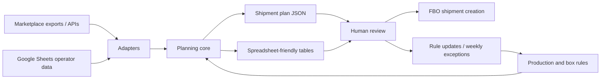

# Marketplace FBO Planner

Open-source planning toolkit for marketplace sellers who need to decide what to send to FBO warehouses, where to send it, and how to pack it without losing margin to stockouts, non-local logistics, oversized boxes, or manual spreadsheet mistakes.

The project started as a production-tested internal workflow for a small automotive accessories manufacturer selling through Wildberries and Ozon. The open-source version extracts the reusable planning core: marketplace demand signals, warehouse coverage rules, box capacity constraints, production availability, and Google Sheets-friendly outputs.

## Why This Exists

Small sellers often run FBO planning from scattered exports, seller dashboards, spreadsheets, and handwritten rules. The hard part is not a single formula. It is reconciling:

- marketplace recommendations and seller-side sales history;
- FBO stock, inbound stock, and days without stock;
- warehouse or cluster geography;
- box capacity and pallet thresholds;
- production limits and reserve stock for FBS/direct channels;
- weekly logistics windows and delivery routes;
- manual review by a human operator before shipment creation.

Marketplace FBO Planner turns those pieces into a repeatable decision workflow.

## Current Status

This repository is an early open-source extraction of a working internal workflow.

Implemented in the public core:

- generic FBO planning data model;
- configurable marketplace and warehouse rules;
- box validation and shipment summary logic;
- sample Wildberries/Ozon-style rules and input data;
- CLI that generates a JSON shipment plan from sample inputs;
- documentation for Google Sheets and AI-assisted review workflows.

Production workflow this was extracted from:

- Google Sheets as the operator interface;
- marketplace exports and API pulls as data sources;
- Python scripts for plan generation and validation;
- Apps Script for manual plan edits inside the spreadsheet;
- AI-assisted review for weekly exceptions, tradeoffs, and rule changes.

Planned marketplace adapters:

- Amazon FBA;
- eBay fulfillment workflows;
- AliExpress / cross-border marketplace fulfillment;
- additional regional marketplaces where sellers need warehouse-level replenishment planning.

## Architecture



The public repository intentionally contains sample data only. Real seller credentials, spreadsheets, SKUs, prices, and operational data must stay private.

## Quick Start

```bash
python3 -m venv .venv
. .venv/bin/activate
pip install -e .
fbo-planner plan --rules examples/rules.sample.json --run examples/run.sample.json --out /tmp/fbo-plan.json
```

Or run without installation:

```bash
python3 -m fbo_planner.cli plan --rules examples/rules.sample.json --run examples/run.sample.json
```

## Example Output

The generated plan contains:

- shipment items by marketplace, warehouse, SKU, and quantity;
- box assignments and validation warnings;
- production shortfall notes;
- summary by marketplace and warehouse;
- machine-readable JSON for spreadsheet upload or further review.

## Roadmap

- CSV/XLSX importers for marketplace exports.
- Google Sheets sync helper with safe sheet allowlists.
- Spreadsheet template for operators.
- Rule packs for different product categories.
- Amazon FBA adapter.
- eBay and AliExpress fulfillment adapters.
- AI review prompts for weekly planning exceptions.
- Tests around stockout risk, box constraints, and warehouse coverage.

## License

MIT. See [LICENSE](LICENSE).

